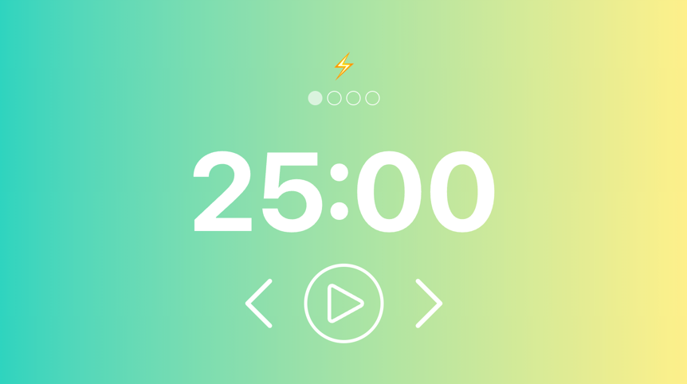

# Pomodoro Thing

A [DeskThing](https://deskthing.app) Pomodoro Timer App

### Usage

- A [Pomodoro](https://en.wikipedia.org/wiki/Pomodoro_Technique) working session is made up of time blocks: focused working time and breaks
  - After the last focus block, the last break is a long break
- Icons at top indicate the type and # of current block
- Center button controls play/pause
- Left/Right buttons control previous/next block
- A bell sound will play (on your computer, not on your CarThing device) when each block ends
- The CarThing wheel increases/decreases the time of your current block

### Configuration

The following can be configured in the DeskThing settings for the Pomodoro Timer app:

- Background colors (use the same color if you don't want a gradient effect)
- Total number of focus blocks in a session
- Block length by type (focus/short break/long break)
- Audio notifications on block completion enabled/disabled

  

